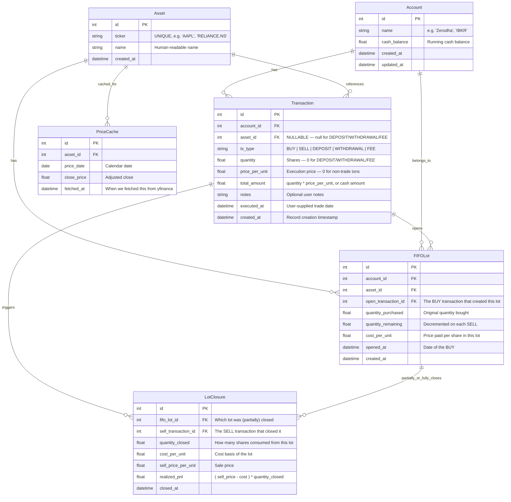
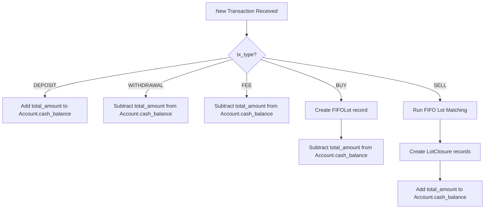
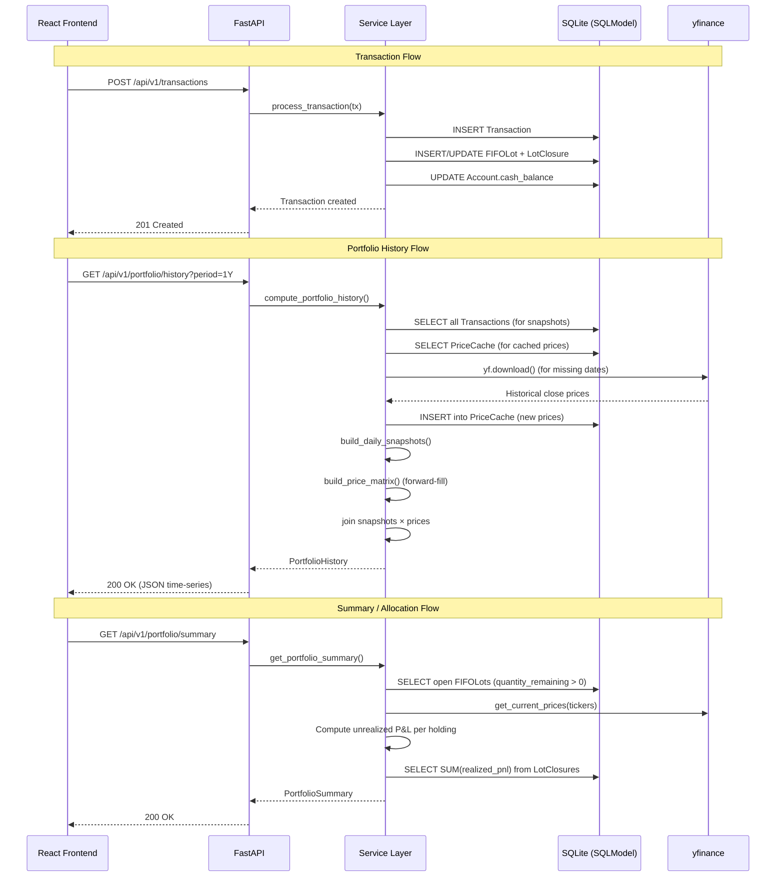

# Folio — Technical Architecture

> A lightweight, single-user stock portfolio tracker with strict FIFO P&L and automated charting via yfinance.

---

## 1. Database Schema (SQLModel)

All tables live in a single SQLite file (`folio.db`). SQLModel is used for ORM models with Pydantic validation baked in.



### Table Definitions (SQLModel Python)

```python
from datetime import datetime, date
from typing import Optional
from enum import Enum
from sqlmodel import SQLModel, Field, Relationship

class TxType(str, Enum):
    BUY = "BUY"
    SELL = "SELL"
    DEPOSIT = "DEPOSIT"
    WITHDRAWAL = "WITHDRAWAL"
    FEE = "FEE"

class Account(SQLModel, table=True):
    id: Optional[int] = Field(default=None, primary_key=True)
    name: str = Field(index=True, unique=True)
    cash_balance: float = Field(default=0.0)
    created_at: datetime = Field(default_factory=datetime.utcnow)
    updated_at: datetime = Field(default_factory=datetime.utcnow)

class Asset(SQLModel, table=True):
    id: Optional[int] = Field(default=None, primary_key=True)
    ticker: str = Field(index=True, unique=True)
    name: str = Field(default="")
    created_at: datetime = Field(default_factory=datetime.utcnow)

class Transaction(SQLModel, table=True):
    id: Optional[int] = Field(default=None, primary_key=True)
    account_id: int = Field(foreign_key="account.id")
    asset_id: Optional[int] = Field(default=None, foreign_key="asset.id")
    tx_type: TxType
    quantity: float = Field(default=0.0)
    price_per_unit: float = Field(default=0.0)
    total_amount: float = Field(default=0.0)
    notes: str = Field(default="")
    executed_at: datetime  # user-supplied trade timestamp
    created_at: datetime = Field(default_factory=datetime.utcnow)

class FIFOLot(SQLModel, table=True):
    id: Optional[int] = Field(default=None, primary_key=True)
    account_id: int = Field(foreign_key="account.id")
    asset_id: int = Field(foreign_key="asset.id")
    open_transaction_id: int = Field(foreign_key="transaction.id")
    quantity_purchased: float
    quantity_remaining: float
    cost_per_unit: float
    opened_at: datetime
    created_at: datetime = Field(default_factory=datetime.utcnow)

class LotClosure(SQLModel, table=True):
    id: Optional[int] = Field(default=None, primary_key=True)
    fifo_lot_id: int = Field(foreign_key="fifolot.id")
    sell_transaction_id: int = Field(foreign_key="transaction.id")
    quantity_closed: float
    cost_per_unit: float
    sell_price_per_unit: float
    realized_pnl: float
    closed_at: datetime = Field(default_factory=datetime.utcnow)

class PriceCache(SQLModel, table=True):
    id: Optional[int] = Field(default=None, primary_key=True)
    asset_id: int = Field(foreign_key="asset.id")
    price_date: date = Field(index=True)
    close_price: float
    fetched_at: datetime = Field(default_factory=datetime.utcnow)

    class Config:
        # Composite uniqueness enforced at app level or via unique constraint
        pass
```

> [!NOTE]
> A `UNIQUE(asset_id, price_date)` constraint should be added to `PriceCache` via a SQLAlchemy `UniqueConstraint` in the `__table_args__`.

---

## 2. REST API Endpoints

Base URL: `http://localhost:8000/api/v1`

### Accounts

| Method | Path | Description | Request Body | Response |
|--------|------|-------------|-------------|----------|
| `GET` | `/accounts` | List all accounts | — | `Account[]` |
| `POST` | `/accounts` | Create a new account | `{ name: str }` | `Account` |
| `GET` | `/accounts/{id}` | Get account details | — | `Account` |
| `PUT` | `/accounts/{id}` | Update account name | `{ name: str }` | `Account` |
| `DELETE` | `/accounts/{id}` | Delete account (fails if transactions exist) | — | `204` |

### Assets

| Method | Path | Description | Request Body | Response |
|--------|------|-------------|-------------|----------|
| `GET` | `/assets` | List all tracked assets | — | `Asset[]` |
| `POST` | `/assets` | Add a new asset/ticker | `{ ticker: str, name?: str }` | `Asset` |
| `GET` | `/assets/{id}` | Get asset details | — | `Asset` |
| `DELETE` | `/assets/{id}` | Delete asset (fails if transactions reference it) | — | `204` |

### Transactions

| Method | Path | Description | Request Body | Response |
|--------|------|-------------|-------------|----------|
| `GET` | `/transactions` | List transactions (filterable by `account_id`, `asset_id`, `tx_type`, paginated) | Query params | `Transaction[]` |
| `POST` | `/transactions` | Create a new transaction (triggers FIFO engine) | `TransactionCreate` | `Transaction` |
| `GET` | `/transactions/{id}` | Get single transaction | — | `Transaction` |
| `DELETE` | `/transactions/{id}` | Delete transaction (triggers full FIFO recalculation) | — | `204` |

#### `TransactionCreate` Schema

```python
class TransactionCreate(SQLModel):
    account_id: int
    asset_id: Optional[int] = None     # Required for BUY/SELL
    tx_type: TxType
    quantity: float = 0.0              # Required for BUY/SELL
    price_per_unit: float = 0.0        # Required for BUY/SELL
    total_amount: float = 0.0          # Required for DEPOSIT/WITHDRAWAL/FEE
    notes: str = ""
    executed_at: datetime
```

> [!IMPORTANT]
> **On DELETE of a transaction:** Because FIFO ordering is sequential and a deletion mid-stream invalidates all subsequent lot closures, the backend must **wipe all `FIFOLot` and `LotClosure` rows** and **replay all remaining transactions** in `executed_at` order to rebuild consistent state. This is the "ledger replay" strategy described in §3.

### Portfolio (Computed / Read-Only)

| Method | Path | Description | Response |
|--------|------|-------------|----------|
| `GET` | `/portfolio/summary` | Current holdings, unrealized P&L per ticker, total portfolio value | `PortfolioSummary` |
| `GET` | `/portfolio/history?period=1Y` | Day-by-day portfolio valuation time-series | `PortfolioHistory` |
| `GET` | `/portfolio/allocation` | Pie-chart data: current market value per ticker | `AllocationSlice[]` |

#### Response Schemas

```python
class HoldingDetail(SQLModel):
    ticker: str
    asset_name: str
    total_shares: float
    avg_cost_basis: float        # Weighted average of remaining FIFO lots
    current_price: float         # Latest from yfinance
    market_value: float          # total_shares * current_price
    unrealized_pnl: float        # market_value - (sum of lot costs)
    unrealized_pnl_pct: float    # unrealized_pnl / total_cost * 100
    realized_pnl: float          # Sum of all LotClosure.realized_pnl for this asset

class PortfolioSummary(SQLModel):
    total_invested: float        # Sum of all BUY total_amounts
    total_market_value: float    # Sum of all holdings' market_value
    total_cash: float            # Sum of all account cash_balances
    total_realized_pnl: float
    total_unrealized_pnl: float
    net_portfolio_value: float   # total_market_value + total_cash
    holdings: list[HoldingDetail]

class PortfolioHistoryPoint(SQLModel):
    date: date
    portfolio_value: float       # Sum of (shares_held * close_price) for each ticker
    cash_balance: float          # Running cash at this point
    total_value: float           # portfolio_value + cash_balance

class PortfolioHistory(SQLModel):
    period: str
    data_points: list[PortfolioHistoryPoint]

class AllocationSlice(SQLModel):
    ticker: str
    market_value: float
    percentage: float
```

---

## 3. FIFO Engine — Service Layer Design

### 3.1 Core Principle

Every `BUY` creates a **lot** — a discrete record of `N` shares purchased at price `P` on date `D`. Every `SELL` **consumes** lots in strict chronological order (oldest `opened_at` first), partially closing a lot if the sell quantity doesn't exhaust it.

### 3.2 Transaction Processing Pipeline



### 3.3 FIFO Lot Matching — Detailed Pseudocode

```python
def process_sell(
    session: Session,
    tx: Transaction,
) -> list[LotClosure]:
    """
    Consume shares from the oldest open lots for this asset+account.
    Returns the list of LotClosure records created.
    """
    remaining_to_sell = tx.quantity
    closures: list[LotClosure] = []

    # Query open lots: same account, same asset, quantity_remaining > 0
    # ORDER BY opened_at ASC  <-- THIS IS THE FIFO GUARANTEE
    open_lots = session.exec(
        select(FIFOLot)
        .where(FIFOLot.account_id == tx.account_id)
        .where(FIFOLot.asset_id == tx.asset_id)
        .where(FIFOLot.quantity_remaining > 0)
        .order_by(FIFOLot.opened_at.asc(), FIFOLot.id.asc())
    ).all()

    for lot in open_lots:
        if remaining_to_sell <= 0:
            break

        # Determine how much to consume from this lot
        qty_from_this_lot = min(lot.quantity_remaining, remaining_to_sell)

        # Calculate realized P&L for this slice
        realized = (tx.price_per_unit - lot.cost_per_unit) * qty_from_this_lot

        # Create the closure record
        closure = LotClosure(
            fifo_lot_id=lot.id,
            sell_transaction_id=tx.id,
            quantity_closed=qty_from_this_lot,
            cost_per_unit=lot.cost_per_unit,
            sell_price_per_unit=tx.price_per_unit,
            realized_pnl=realized,
        )
        closures.append(closure)
        session.add(closure)

        # Decrement the lot's remaining quantity
        lot.quantity_remaining -= qty_from_this_lot
        session.add(lot)

        remaining_to_sell -= qty_from_this_lot

    if remaining_to_sell > 0:
        raise ValueError(
            f"Insufficient shares to sell. "
            f"Tried to sell {tx.quantity} shares of asset_id={tx.asset_id}, "
            f"but only {tx.quantity - remaining_to_sell} available in FIFO lots."
        )

    return closures
```

### 3.4 Full Transaction Processor

```python
def process_transaction(session: Session, tx: Transaction) -> None:
    """
    Central dispatch: routes each transaction type to the correct handler.
    All balance mutations happen here.
    """
    account = session.get(Account, tx.account_id)

    match tx.tx_type:
        case TxType.DEPOSIT:
            account.cash_balance += tx.total_amount

        case TxType.WITHDRAWAL:
            if account.cash_balance < tx.total_amount:
                raise ValueError("Insufficient cash for withdrawal.")
            account.cash_balance -= tx.total_amount

        case TxType.FEE:
            account.cash_balance -= tx.total_amount

        case TxType.BUY:
            cost = tx.quantity * tx.price_per_unit
            tx.total_amount = cost  # Ensure consistency
            if account.cash_balance < cost:
                raise ValueError("Insufficient cash for purchase.")
            account.cash_balance -= cost

            lot = FIFOLot(
                account_id=tx.account_id,
                asset_id=tx.asset_id,
                open_transaction_id=tx.id,
                quantity_purchased=tx.quantity,
                quantity_remaining=tx.quantity,
                cost_per_unit=tx.price_per_unit,
                opened_at=tx.executed_at,
            )
            session.add(lot)

        case TxType.SELL:
            proceeds = tx.quantity * tx.price_per_unit
            tx.total_amount = proceeds
            process_sell(session, tx)
            account.cash_balance += proceeds

    account.updated_at = datetime.utcnow()
    session.add(account)
    session.commit()
```

### 3.5 Ledger Replay (for Transaction Deletion / Edits)

When a transaction is deleted, the FIFO chain is broken. The safest and most correct strategy is a **full replay**:

```python
def replay_ledger(session: Session, account_id: int) -> None:
    """
    Wipe all computed state (FIFOLots, LotClosures) for this account
    and replay all transactions in executed_at order.
    """
    # 1. Delete all LotClosures linked to this account's lots
    lots = session.exec(
        select(FIFOLot).where(FIFOLot.account_id == account_id)
    ).all()
    lot_ids = [l.id for l in lots]
    if lot_ids:
        session.exec(
            delete(LotClosure).where(LotClosure.fifo_lot_id.in_(lot_ids))
        )

    # 2. Delete all FIFOLots for this account
    session.exec(
        delete(FIFOLot).where(FIFOLot.account_id == account_id)
    )

    # 3. Reset account cash balance to 0
    account = session.get(Account, account_id)
    account.cash_balance = 0.0

    # 4. Fetch all remaining transactions, ordered chronologically
    transactions = session.exec(
        select(Transaction)
        .where(Transaction.account_id == account_id)
        .order_by(Transaction.executed_at.asc(), Transaction.id.asc())
    ).all()

    # 5. Replay each one through the processor
    for tx in transactions:
        process_transaction(session, tx)
```

> [!WARNING]
> Replay cost scales linearly with the number of transactions per account. For a single-user personal tracker this is acceptable (hundreds to low-thousands of transactions). If performance becomes a concern, checkpoint-based replay can be added later — but this is explicitly out of scope.

---

## 4. Portfolio Valuation Time-Series — yfinance Integration

### 4.1 Problem Statement

To render a "Portfolio Value Over Time" line chart, the backend must produce a data point for **every calendar day** from the first transaction to today. Each data point is:

```
total_value(day) = cash_balance(day) + Σ (shares_held(ticker, day) × close_price(ticker, day))
```

The challenges:
1. **Markets are closed on weekends and holidays** — yfinance has no data for those days.
2. **Different tickers may have different trading calendars** (e.g., NYSE vs NSE).
3. **New holdings appear mid-stream** — the share count for a ticker can be 0 before the first BUY.

### 4.2 Algorithm: Ledger Snapshots × Price Matrix

The algorithm has two independent phases that are then joined.

#### Phase A — Build the Daily Ledger Snapshots

Walk through all transactions in chronological order and produce a **running snapshot** of `{ticker: shares_held}` and `cash_balance` for each calendar day.

```python
from datetime import date, timedelta
from collections import defaultdict

def build_daily_snapshots(
    transactions: list[Transaction],
    start_date: date,
    end_date: date,
) -> list[dict]:
    """
    Returns a list of daily snapshots:
    [
        {
            "date": date(2024, 1, 15),
            "holdings": {"AAPL": 10, "GOOGL": 5},
            "cash": 5000.0,
        },
        ...
    ]
    """
    # Sort transactions by executed_at
    txns_sorted = sorted(transactions, key=lambda t: (t.executed_at, t.id))

    # Build a dict: date -> list of transactions on that date
    txns_by_date: dict[date, list[Transaction]] = defaultdict(list)
    for tx in txns_sorted:
        txns_by_date[tx.executed_at.date()].append(tx)

    snapshots = []
    current_holdings: dict[str, float] = defaultdict(float)  # ticker -> shares
    current_cash: float = 0.0

    current_day = start_date
    while current_day <= end_date:
        # Apply any transactions that occurred on this day
        for tx in txns_by_date.get(current_day, []):
            match tx.tx_type:
                case TxType.BUY:
                    ticker = get_ticker(tx.asset_id)  # lookup
                    current_holdings[ticker] += tx.quantity
                    current_cash -= tx.quantity * tx.price_per_unit
                case TxType.SELL:
                    ticker = get_ticker(tx.asset_id)
                    current_holdings[ticker] -= tx.quantity
                    current_cash += tx.quantity * tx.price_per_unit
                case TxType.DEPOSIT:
                    current_cash += tx.total_amount
                case TxType.WITHDRAWAL:
                    current_cash -= tx.total_amount
                case TxType.FEE:
                    current_cash -= tx.total_amount

        snapshots.append({
            "date": current_day,
            "holdings": dict(current_holdings),  # copy
            "cash": current_cash,
        })
        current_day += timedelta(days=1)

    return snapshots
```

#### Phase B — Build the Price Matrix (with Forward-Fill)

For every unique ticker that has ever been held, fetch historical daily closes from yfinance. Then **forward-fill** to cover weekends, holidays, and any missing dates.

```python
import yfinance as yf
import pandas as pd

def build_price_matrix(
    tickers: list[str],
    start_date: date,
    end_date: date,
    session: Session,  # for PriceCache reads/writes
) -> dict[str, dict[date, float]]:
    """
    Returns: { "AAPL": { date(2024,1,2): 185.5, date(2024,1,3): 186.0, ... }, ... }
    Gaps (weekends/holidays) are forward-filled with the last known close.
    """
    price_matrix: dict[str, dict[date, float]] = {}
    full_date_range = pd.date_range(start=start_date, end=end_date, freq="D")

    for ticker in tickers:
        # Step 1: Check PriceCache for existing data
        cached = load_cached_prices(session, ticker, start_date, end_date)

        # Step 2: Determine the date range we still need from yfinance
        missing_start, missing_end = find_missing_range(cached, start_date, end_date)

        # Step 3: Fetch missing data from yfinance
        if missing_start and missing_end:
            df = yf.download(
                ticker,
                start=str(missing_start),
                end=str(missing_end + timedelta(days=1)),
                progress=False,
            )
            if not df.empty:
                # Store in PriceCache
                for row_date, row in df.iterrows():
                    upsert_price_cache(
                        session, ticker, row_date.date(), float(row["Close"])
                    )

        # Step 4: Build the final series from cache
        all_prices = load_cached_prices(session, ticker, start_date, end_date)

        # Step 5: Convert to a pandas Series and forward-fill
        price_series = pd.Series(
            {p.price_date: p.close_price for p in all_prices},
            dtype=float,
        )
        # Reindex to the full date range (daily) and forward-fill
        price_series = price_series.reindex(
            full_date_range.date
        ).ffill().bfill()  # bfill only for days before the first trade date

        price_matrix[ticker] = price_series.to_dict()

    return price_matrix
```

> [!TIP]
> **Why `bfill()` at the end?** If the portfolio's `start_date` falls on a Saturday but the first yfinance data point is the preceding Friday, the Saturday–Sunday gap at the start would be `NaN`. A single backward-fill handles this edge case. After that, only forward-fill is used.

#### Phase C — Join Snapshots × Prices

```python
def compute_portfolio_history(
    snapshots: list[dict],
    price_matrix: dict[str, dict[date, float]],
) -> list[PortfolioHistoryPoint]:
    """
    For each daily snapshot, compute the total portfolio value.
    """
    history = []
    for snap in snapshots:
        stock_value = 0.0
        for ticker, shares in snap["holdings"].items():
            if shares > 0:
                price = price_matrix.get(ticker, {}).get(snap["date"], 0.0)
                stock_value += shares * price

        history.append(PortfolioHistoryPoint(
            date=snap["date"],
            portfolio_value=round(stock_value, 2),
            cash_balance=round(snap["cash"], 2),
            total_value=round(stock_value + snap["cash"], 2),
        ))
    return history
```

### 4.3 Price Caching Strategy

| Aspect | Strategy |
|--------|----------|
| **Cache key** | `(asset_id, price_date)` — unique constraint |
| **Cache invalidation** | Today's price is re-fetched on every request (TTL: 0 for current day). Historical dates are immutable once fetched. |
| **Fetch granularity** | One `yf.download()` call per ticker per missing date range. Batch all tickers in a single API layer call. |
| **Storage** | SQLite `PriceCache` table — survives server restarts. |
| **Fallback** | If yfinance fails for a ticker (e.g., delisted), return the last cached price and log a warning. |

### 4.4 Current Price Fetching (for Unrealized P&L)

For the `/portfolio/summary` and `/portfolio/allocation` endpoints, the backend fetches the **latest available price** for each held ticker:

```python
def get_current_prices(tickers: list[str]) -> dict[str, float]:
    """Fetch latest prices using yfinance Ticker.fast_info or history(period='1d')."""
    prices = {}
    for ticker in tickers:
        try:
            t = yf.Ticker(ticker)
            # fast_info provides the last price without downloading full history
            prices[ticker] = t.fast_info.get("lastPrice", 0.0)
        except Exception:
            # Fallback: use last cached price
            prices[ticker] = get_last_cached_price(ticker)
    return prices
```

### 4.5 Architecture Diagram — Request Flow



---

## 5. Project Structure

```
folio/
├── backend/
│   ├── app/
│   │   ├── __init__.py
│   │   ├── main.py              # FastAPI app factory, CORS, lifespan
│   │   ├── config.py            # Settings (DB path, etc.)
│   │   ├── database.py          # Engine, Session, create_all
│   │   ├── models.py            # All SQLModel table definitions
│   │   ├── schemas.py           # Pydantic request/response schemas
│   │   ├── routers/
│   │   │   ├── __init__.py
│   │   │   ├── accounts.py      # /api/v1/accounts
│   │   │   ├── assets.py        # /api/v1/assets
│   │   │   ├── transactions.py  # /api/v1/transactions
│   │   │   └── portfolio.py     # /api/v1/portfolio/*
│   │   ├── services/
│   │   │   ├── __init__.py
│   │   │   ├── fifo_engine.py   # FIFO lot matching & ledger replay
│   │   │   ├── portfolio.py     # Summary, history, allocation
│   │   │   └── price_service.py # yfinance fetching & PriceCache
│   │   └── utils.py             # Helpers
│   ├── tests/
│   │   ├── test_fifo_engine.py
│   │   ├── test_portfolio.py
│   │   └── test_api.py
│   ├── requirements.txt
│   └── folio.db                 # SQLite file (gitignored)
├── frontend/
│   ├── src/
│   │   ├── api/                 # Axios/fetch wrappers
│   │   │   └── client.ts
│   │   ├── components/
│   │   │   ├── layout/          # Sidebar, Header, Shell
│   │   │   ├── dashboard/       # Summary cards, charts
│   │   │   ├── transactions/    # Table, add/edit forms
│   │   │   └── ui/              # Reusable primitives
│   │   ├── hooks/
│   │   │   └── usePortfolio.ts  # TanStack Query hooks
│   │   ├── pages/
│   │   │   ├── Dashboard.tsx
│   │   │   ├── Transactions.tsx
│   │   │   └── Holdings.tsx
│   │   ├── types/
│   │   │   └── index.ts         # TypeScript interfaces mirroring backend schemas
│   │   ├── App.tsx
│   │   ├── main.tsx
│   │   └── index.css            # Tailwind directives
│   ├── tailwind.config.js
│   ├── tsconfig.json
│   ├── vite.config.ts
│   └── package.json
└── README.md
```
