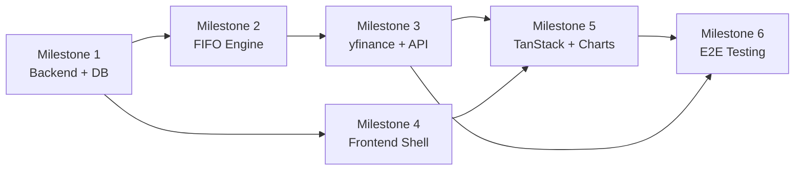

# Folio — Milestone Implementation Plan

> Sequential, granular build plan for the Folio personal stock portfolio tracker.
> Each milestone ends with a **Validation Checkpoint** — do not proceed until it passes.

---

## Milestone 1: Minimal Backend Setup & Database Layer

**Goal:** A running FastAPI server with SQLite, all models created, and basic CRUD for Accounts and Assets.

### Tasks

#### 1.1 — Project Scaffolding

- [ ] Create the project directory structure as defined in `ARCHITECTURE.md §5`.
- [ ] Initialize a Python virtual environment (`python -m venv .venv`).
- [ ] Create `requirements.txt`:
  ```
  fastapi>=0.110
  uvicorn[standard]>=0.29
  sqlmodel>=0.0.16
  yfinance>=0.2.37
  pandas>=2.2
  httpx>=0.27        # for test client
  pytest>=8.1
  ```
- [ ] Install dependencies: `pip install -r requirements.txt`.

#### 1.2 — Configuration & Database Bootstrap

- [ ] **`app/config.py`**: Define a `Settings` class with:
  - `DATABASE_URL: str = "sqlite:///./folio.db"`
  - `API_V1_PREFIX: str = "/api/v1"`
- [ ] **`app/database.py`**:
  - Create `engine = create_engine(DATABASE_URL, connect_args={"check_same_thread": False})`
  - Define `get_session()` dependency (yields a `Session`).
  - Define `create_db_and_tables()` calling `SQLModel.metadata.create_all(engine)`.
- [ ] **`app/models.py`**: Implement all 6 SQLModel table classes exactly as specified in `ARCHITECTURE.md §1`:
  - `Account`, `Asset`, `Transaction`, `FIFOLot`, `LotClosure`, `PriceCache`.
  - Add `TxType` enum.
  - Add `UniqueConstraint("asset_id", "price_date")` to `PriceCache` via `__table_args__`.

#### 1.3 — FastAPI App Factory

- [ ] **`app/main.py`**:
  - Create `FastAPI` app with title "Folio API".
  - Add CORS middleware (allow `http://localhost:5173` for Vite dev server).
  - Add `lifespan` context manager that calls `create_db_and_tables()` on startup.
  - Include routers (empty stubs for now).
  - Add a root healthcheck: `GET /` → `{"status": "ok"}`.

#### 1.4 — Account CRUD Router

- [ ] **`app/schemas.py`**: Create `AccountCreate(name: str)` and `AccountUpdate(name: str)` Pydantic models.
- [ ] **`app/routers/accounts.py`**: Implement all 5 endpoints from `ARCHITECTURE.md §2 — Accounts`:
  - `GET /accounts` — list all.
  - `POST /accounts` — create (reject duplicate names).
  - `GET /accounts/{id}` — get one or 404.
  - `PUT /accounts/{id}` — update name.
  - `DELETE /accounts/{id}` — delete (reject if transactions exist, return 409).

#### 1.5 — Asset CRUD Router

- [ ] **`app/routers/assets.py`**: Implement all 4 endpoints from `ARCHITECTURE.md §2 — Assets`:
  - `GET /assets` — list all.
  - `POST /assets` — create (reject duplicate tickers, auto-uppercase ticker).
  - `GET /assets/{id}` — get one or 404.
  - `DELETE /assets/{id}` — reject if referenced by transactions.

### ✅ Validation Checkpoint 1

```bash
# Start the server
uvicorn app.main:app --reload

# Verify
curl http://localhost:8000/                          # {"status":"ok"}
curl -X POST http://localhost:8000/api/v1/accounts \
  -H "Content-Type: application/json" \
  -d '{"name":"Zerodha"}'                            # 201, returns Account JSON
curl http://localhost:8000/api/v1/accounts            # Returns list with 1 account
curl -X POST http://localhost:8000/api/v1/assets \
  -H "Content-Type: application/json" \
  -d '{"ticker":"AAPL","name":"Apple Inc."}'          # 201
curl http://localhost:8000/api/v1/assets              # Returns list with 1 asset
```

- [ ] All endpoints return correct status codes (200, 201, 404, 409).
- [ ] `folio.db` file is created with all 6 tables (verify via `sqlite3 folio.db ".tables"`).
- [ ] Duplicate account name → 409. Duplicate asset ticker → 409.

---

## Milestone 2: FIFO Core Logic & Python Service Engine

**Goal:** The `fifo_engine` service correctly processes BUY/SELL/DEPOSIT/WITHDRAWAL/FEE transactions, maintains FIFO lots, and supports ledger replay.

### Tasks

#### 2.1 — Transaction Schemas

- [ ] **`app/schemas.py`**: Add `TransactionCreate` schema as defined in `ARCHITECTURE.md §2`:
  - Fields: `account_id`, `asset_id` (optional), `tx_type`, `quantity`, `price_per_unit`, `total_amount`, `notes`, `executed_at`.
  - Add validation: if `tx_type` is BUY/SELL → `asset_id`, `quantity`, `price_per_unit` are required and > 0.
  - Add validation: if `tx_type` is DEPOSIT/WITHDRAWAL/FEE → `total_amount` is required and > 0.

#### 2.2 — FIFO Engine Service

- [ ] **`app/services/fifo_engine.py`**: Implement three core functions:
  1. `process_sell(session, tx) -> list[LotClosure]` — FIFO lot matching as per `ARCHITECTURE.md §3.3`.
  2. `process_transaction(session, tx)` — central dispatcher as per `ARCHITECTURE.md §3.4`.
  3. `replay_ledger(session, account_id)` — full replay as per `ARCHITECTURE.md §3.5`.

- [ ] **Edge cases to handle:**
  - SELL with insufficient shares → raise `ValueError` with descriptive message (→ API returns 400).
  - WITHDRAWAL with insufficient cash → raise `ValueError` (→ API returns 400).
  - BUY with insufficient cash → raise `ValueError` (→ API returns 400).
  - SELL that spans multiple lots (partial + full closure in one sell).
  - SELL that exactly exhausts a single lot.

#### 2.3 — Transaction Router

- [ ] **`app/routers/transactions.py`**: Implement:
  - `GET /transactions` — list with optional query filters: `account_id`, `asset_id`, `tx_type`. Support pagination via `skip` and `limit` params (default: `skip=0, limit=100`).
  - `POST /transactions`:
    1. Validate the request body.
    2. Verify `account_id` and `asset_id` (if present) exist → 404 if not.
    3. Insert the `Transaction` row.
    4. Call `process_transaction(session, tx)`.
    5. Return the created transaction (201).
    6. On `ValueError` from the engine → return 400 with error detail.
  - `GET /transactions/{id}` — single transaction or 404.
  - `DELETE /transactions/{id}`:
    1. Delete the transaction row.
    2. Call `replay_ledger(session, account_id)` to rebuild state.
    3. Return 204.

#### 2.4 — Unit Tests for FIFO Engine

- [ ] **`tests/test_fifo_engine.py`**: Write comprehensive tests:

| Test Case | Description |
|-----------|-------------|
| `test_buy_creates_lot` | A single BUY creates exactly one `FIFOLot` with correct fields. |
| `test_sell_consumes_oldest_lot_first` | Two BUYs at different prices, one SELL → lot from first BUY is consumed. |
| `test_sell_partial_lot` | BUY 100 shares, SELL 30 → `quantity_remaining` is 70. |
| `test_sell_spans_multiple_lots` | BUY 50, BUY 50, SELL 80 → first lot fully closed (50), second partially closed (30). |
| `test_sell_exact_full_lot` | BUY 100, SELL 100 → `quantity_remaining` is 0. |
| `test_sell_insufficient_shares` | BUY 50, SELL 100 → raises `ValueError`. |
| `test_realized_pnl_calculation` | BUY at 10, SELL at 15 → `realized_pnl = 5 * qty`. |
| `test_deposit_increases_cash` | DEPOSIT 10000 → `Account.cash_balance == 10000`. |
| `test_withdrawal_insufficient_cash` | WITHDRAWAL exceeding balance → raises `ValueError`. |
| `test_fee_decreases_cash` | FEE 50 → cash decreases by 50. |
| `test_replay_ledger` | Create 5 txns, delete the 3rd, replay → final state matches expected. |
| `test_fifo_order_with_same_date` | Two BUYs on same date → FIFO breaks tie by `id` (insertion order). |

### ✅ Validation Checkpoint 2

```bash
# Run unit tests
cd backend && pytest tests/test_fifo_engine.py -v
```

- [ ] All 12+ unit tests pass.
- [ ] Manual API test:
  ```bash
  # Deposit cash, buy shares, sell partial, check account balance
  # POST DEPOSIT $10,000 → cash = $10,000
  # POST BUY 100 AAPL @ $50 → cash = $5,000, 1 lot created
  # POST BUY 50 AAPL @ $60 → cash = $2,000, 2 lots
  # POST SELL 120 AAPL @ $70 → cash = $2,000 + $8,400 = $10,400
  #   Lot 1: 100 shares closed, realized P&L = (70-50)*100 = $2,000
  #   Lot 2: 20 shares closed, realized P&L = (70-60)*20 = $200
  #   Lot 2: 30 shares remaining
  ```
- [ ] Verify `FIFOLot` and `LotClosure` tables contain correct rows after the above sequence.

---

## Milestone 3: yfinance Integration & Portfolio API Endpoints

**Goal:** Historical price fetching with caching, portfolio summary with unrealized P&L, portfolio history time-series, and allocation data — all served via API.

### Tasks

#### 3.1 — Price Service

- [ ] **`app/services/price_service.py`**: Implement:
  1. `fetch_and_cache_prices(session, ticker, start_date, end_date)`:
     - Check `PriceCache` for existing data in the range.
     - Determine the missing sub-range(s).
     - Call `yf.download(ticker, start, end)` for missing data.
     - Upsert results into `PriceCache`.
     - Handle yfinance errors gracefully (log warning, return partial data).
  2. `get_current_prices(tickers: list[str]) -> dict[str, float]`:
     - Use `yf.Ticker(ticker).fast_info["lastPrice"]` for each ticker.
     - Fallback to the latest `PriceCache` entry if yfinance fails.
  3. `build_price_matrix(session, tickers, start_date, end_date) -> dict[str, dict[date, float]]`:
     - Calls `fetch_and_cache_prices` for each ticker.
     - Builds a pandas Series per ticker, reindexed to full daily range, forward-filled.
     - Returns the nested dict as described in `ARCHITECTURE.md §4.2 Phase B`.

#### 3.2 — Portfolio Service

- [ ] **`app/services/portfolio.py`**: Implement:
  1. `get_portfolio_summary(session) -> PortfolioSummary`:
     - Query all `FIFOLot` rows with `quantity_remaining > 0`, grouped by `asset_id`.
     - For each ticker: compute `total_shares`, weighted `avg_cost_basis` from open lots.
     - Fetch current prices via `price_service.get_current_prices()`.
     - Compute `market_value`, `unrealized_pnl`, `unrealized_pnl_pct` per holding.
     - Sum `realized_pnl` from `LotClosure` grouped by `asset_id`.
     - Aggregate totals.
  2. `get_portfolio_history(session, period: str) -> PortfolioHistory`:
     - Determine `start_date` from `period` (1M, 3M, 6M, 1Y, ALL).
     - Call `build_daily_snapshots()` (from `ARCHITECTURE.md §4.2 Phase A`).
     - Call `build_price_matrix()` for all tickers present in snapshots.
     - Call `compute_portfolio_history()` to join (from `ARCHITECTURE.md §4.2 Phase C`).
  3. `get_portfolio_allocation(session) -> list[AllocationSlice]`:
     - Same as summary but returns only `{ticker, market_value, percentage}` slices.

#### 3.3 — Portfolio API Schema & Router

- [ ] **`app/schemas.py`**: Add response schemas:
  - `HoldingDetail`, `PortfolioSummary`, `PortfolioHistoryPoint`, `PortfolioHistory`, `AllocationSlice` — as defined in `ARCHITECTURE.md §2`.
- [ ] **`app/routers/portfolio.py`**: Implement:
  - `GET /portfolio/summary` → calls `get_portfolio_summary()`.
  - `GET /portfolio/history?period=1Y` → calls `get_portfolio_history()`.
  - `GET /portfolio/allocation` → calls `get_portfolio_allocation()`.

#### 3.4 — Price Caching Tests

- [ ] **`tests/test_portfolio.py`**: Write tests:

| Test Case | Description |
|-----------|-------------|
| `test_price_cache_stores_fetched_data` | After fetching, `PriceCache` rows exist for the date range. |
| `test_price_cache_avoids_refetch` | Second call for same range does NOT call yfinance again (mock). |
| `test_forward_fill_weekends` | Price matrix for a Friday + Saturday + Sunday + Monday → Sat/Sun have Friday's price. |
| `test_portfolio_summary_empty` | No holdings → summary has all zeros. |
| `test_portfolio_history_shape` | History for 30 days → exactly 30 data points. |
| `test_unrealized_pnl_calculation` | BUY 100 @ $50, current price $60 → unrealized = $1,000. |

### ✅ Validation Checkpoint 3

```bash
cd backend && pytest tests/ -v
```

- [ ] All tests pass (Milestone 2 + Milestone 3).
- [ ] Manual API test with live yfinance data:
  ```bash
  # After creating account + AAPL asset + deposit + buy transactions:
  curl http://localhost:8000/api/v1/portfolio/summary
  # → Returns JSON with current_price from live market, unrealized P&L.

  curl "http://localhost:8000/api/v1/portfolio/history?period=1M"
  # → Returns 30 data points with portfolio_value, cash_balance, total_value.

  curl http://localhost:8000/api/v1/portfolio/allocation
  # → Returns allocation slices with percentages summing to ~100%.
  ```
- [ ] Verify `PriceCache` table has rows (confirms caching works).
- [ ] Second call to `/portfolio/history` is faster (cached prices, no yfinance call).

---

## Milestone 4: Frontend UI Shell & Layout

**Goal:** A polished React + Vite + TypeScript + Tailwind app with routing, a responsive sidebar layout, and placeholder pages for Dashboard, Transactions, and Holdings.

### Tasks

#### 4.1 — Vite + React + TypeScript Scaffolding

- [ ] From the `frontend/` directory, scaffold with Vite:
  ```bash
  npx -y create-vite@latest ./ --template react-ts
  ```
- [ ] Install dependencies:
  ```bash
  npm install react-router-dom @tanstack/react-query recharts axios
  npm install -D tailwindcss @tailwindcss/vite
  ```
- [ ] Configure Tailwind CSS:
  - Add Tailwind Vite plugin in `vite.config.ts`.
  - Set up `index.css` with `@import "tailwindcss"` directive.
- [ ] Configure Vite proxy for API calls:
  ```ts
  // vite.config.ts
  server: {
    proxy: {
      '/api': 'http://localhost:8000'
    }
  }
  ```

#### 4.2 — Design System & Global Styles

- [ ] **`src/index.css`**: Establish design tokens via Tailwind's `@theme`:
  - Dark-mode-first color palette (deep navy/slate backgrounds, vibrant accent greens/reds for P&L).
  - Typography: Import Inter or Outfit from Google Fonts.
  - Card styles: Glassmorphism with `backdrop-blur` and subtle borders.
  - Smooth transitions and micro-animations as defaults.

#### 4.3 — App Shell & Routing

- [ ] **`src/App.tsx`**: Set up `BrowserRouter` with routes:
  - `/` → `Dashboard`
  - `/transactions` → `Transactions`
  - `/holdings` → `Holdings`
- [ ] **`src/components/layout/Sidebar.tsx`**: Navigation sidebar with:
  - App logo/name "Folio".
  - Nav links: Dashboard, Transactions, Holdings.
  - Active state highlighting.
  - Collapsible on mobile.
- [ ] **`src/components/layout/AppShell.tsx`**: Main layout wrapper combining sidebar + content area.

#### 4.4 — TypeScript Types

- [ ] **`src/types/index.ts`**: Define interfaces mirroring all backend response schemas:
  - `Account`, `Asset`, `Transaction`, `TransactionCreate`.
  - `HoldingDetail`, `PortfolioSummary`.
  - `PortfolioHistoryPoint`, `PortfolioHistory`.
  - `AllocationSlice`.
  - `TxType` enum.

#### 4.5 — API Client Layer

- [ ] **`src/api/client.ts`**: Create an Axios instance with `baseURL: "/api/v1"`.
- [ ] **`src/api/accounts.ts`**: CRUD functions for accounts.
- [ ] **`src/api/assets.ts`**: CRUD functions for assets.
- [ ] **`src/api/transactions.ts`**: CRUD functions for transactions.
- [ ] **`src/api/portfolio.ts`**: `getSummary()`, `getHistory(period)`, `getAllocation()`.

#### 4.6 — Placeholder Pages

- [ ] **`src/pages/Dashboard.tsx`**: Static placeholder layout with:
  - 4 summary stat cards (Total Value, Invested, Unrealized P&L, Realized P&L) — hardcoded.
  - Empty chart container.
  - Empty allocation pie container.
- [ ] **`src/pages/Transactions.tsx`**: Placeholder transaction table with a "+ Add Trade" button.
- [ ] **`src/pages/Holdings.tsx`**: Placeholder holdings table.

### ✅ Validation Checkpoint 4

```bash
cd frontend && npm run dev
```

- [ ] App loads at `http://localhost:5173` without errors.
- [ ] Sidebar navigation works — clicking links routes correctly with no full page reload.
- [ ] All 3 pages render their placeholder content.
- [ ] Dark mode styling is applied, fonts load, layout is responsive.
- [ ] Vite proxy works: `fetch("/api/v1/accounts")` from browser console returns data from the running backend.

---

## Milestone 5: TanStack Query Integration & Charts

**Goal:** All pages are fully wired to live backend data via TanStack Query. The Dashboard shows a functioning Portfolio Value line chart (Recharts) and allocation pie chart. The Transactions page supports full CRUD with optimistic-feeling updates.

### Tasks

#### 5.1 — TanStack Query Setup

- [ ] **`src/main.tsx`**: Wrap `<App>` with `<QueryClientProvider>`.
  - Configure default `staleTime: 30_000` (30 seconds) and `refetchOnWindowFocus: true`.

#### 5.2 — Custom Hooks

- [ ] **`src/hooks/useAccounts.ts`**:
  - `useAccounts()` → `useQuery` for listing accounts.
  - `useCreateAccount()` → `useMutation` with `queryClient.invalidateQueries`.
- [ ] **`src/hooks/useAssets.ts`**:
  - `useAssets()` → `useQuery` for listing assets.
  - `useCreateAsset()` → `useMutation`.
- [ ] **`src/hooks/useTransactions.ts`**:
  - `useTransactions(filters?)` → `useQuery` with filter params.
  - `useCreateTransaction()` → `useMutation` that invalidates `["transactions"]` AND `["portfolio"]` queries.
  - `useDeleteTransaction()` → `useMutation` that invalidates same keys.
- [ ] **`src/hooks/usePortfolio.ts`**:
  - `usePortfolioSummary()` → `useQuery(["portfolio", "summary"])`.
  - `usePortfolioHistory(period)` → `useQuery(["portfolio", "history", period])`.
  - `usePortfolioAllocation()` → `useQuery(["portfolio", "allocation"])`.

#### 5.3 — Dashboard Page (Live Data)

- [ ] **Summary Cards**: Replace hardcoded values with data from `usePortfolioSummary()`.
  - Net Portfolio Value (large, prominent).
  - Total Invested.
  - Unrealized P&L (green if positive, red if negative, with percentage).
  - Realized P&L.
  - Total Cash.
  - Add loading skeleton states.
- [ ] **Portfolio Value Line Chart** (Recharts `<AreaChart>`):
  - Data from `usePortfolioHistory(period)`.
  - Period selector buttons: 1M, 3M, 6M, 1Y, ALL.
  - X-axis: dates. Y-axis: total_value.
  - Gradient fill under the line. Tooltip showing date + value.
  - Smooth animation on period switch.
- [ ] **Allocation Pie Chart** (Recharts `<PieChart>`):
  - Data from `usePortfolioAllocation()`.
  - Custom colors per slice. Labels with ticker + percentage.
  - Center label showing total market value.

#### 5.4 — Transactions Page (Full CRUD)

- [ ] **Transaction Table**:
  - Columns: Date, Type, Ticker, Quantity, Price, Total, Notes, Actions.
  - Color-coded type badges (green=BUY, red=SELL, blue=DEPOSIT, etc.).
  - Delete button per row with confirmation dialog.
  - Empty state when no transactions.
- [ ] **Add Transaction Modal/Form**:
  - Triggered by "+ Add Trade" button.
  - Fields: Account (dropdown), Type (radio/select), Ticker (dropdown from assets), Quantity, Price, Total Amount, Date, Notes.
  - Dynamic form: show Ticker/Qty/Price fields for BUY/SELL, show Amount field for DEPOSIT/WITHDRAWAL/FEE.
  - Submit calls `useCreateTransaction()`. On success, close modal and table refetches.
  - Show error toast on validation failure (e.g., insufficient shares).
- [ ] **Add Asset Inline**: If the user types a new ticker not in the asset list, offer to create it on the fly.

#### 5.5 — Holdings Page

- [ ] **Holdings Table**:
  - Columns: Ticker, Name, Shares, Avg Cost, Current Price, Market Value, Unrealized P&L ($ and %), Realized P&L.
  - Data from `usePortfolioSummary()` → `holdings` array.
  - Color the P&L columns green/red.
  - Totals row at the bottom.

#### 5.6 — Error & Loading States

- [ ] Skeleton loaders for all data-dependent components.
- [ ] Error boundaries or error banners when API calls fail.
- [ ] Toast notifications for successful create/delete actions.

### ✅ Validation Checkpoint 5

- [ ] **Dashboard**: Summary cards show live data. Line chart renders with correct date range. Switching periods re-fetches and re-renders. Pie chart shows allocation.
- [ ] **Transactions**: Full create + delete workflow works. After adding a BUY, the dashboard summary updates (P&L changes, chart extends).
- [ ] **Holdings**: Table reflects current FIFO state. Unrealized P&L matches manual calculation.
- [ ] **State coherence**: Adding a SELL transaction → Dashboard P&L updates, Holdings shares decrease, chart re-renders — all without manual page refresh.
- [ ] **No console errors** in the browser dev tools.

---

## Milestone 6: End-to-End Testing & Validation

**Goal:** Comprehensive verification that the full stack works correctly, with special focus on FIFO math accuracy and chart data integrity.

### Tasks

#### 6.1 — Backend Integration Tests

- [ ] **`tests/test_api.py`**: Full API integration tests using FastAPI's `TestClient`:

| Test | Steps |
|------|-------|
| `test_full_trade_lifecycle` | Create account → deposit → buy → buy → sell (spanning 2 lots) → verify summary P&L |
| `test_delete_transaction_replays` | Create 5 txns → delete middle one → verify lots and cash are correct |
| `test_portfolio_history_data_integrity` | Create trades over multiple dates → fetch history → verify each day's total_value |
| `test_sell_more_than_owned` | Attempt to sell more shares than held → expect 400 |
| `test_withdraw_more_than_cash` | Attempt to withdraw more than balance → expect 400 |
| `test_delete_account_with_transactions` | Attempt to delete account that has transactions → expect 409 |

#### 6.2 — FIFO Math Accuracy Test (Known Scenario)

- [ ] Create a deterministic test scenario with pre-calculated expected values:

  ```
  Day 1:  DEPOSIT $50,000
  Day 2:  BUY  100 AAPL @ $150  ($15,000) → Lot A: 100 @ $150
  Day 5:  BUY   50 AAPL @ $160  ($8,000)  → Lot B:  50 @ $160
  Day 10: BUY   75 GOOGL @ $140 ($10,500) → Lot C:  75 @ $140
  Day 15: SELL  120 AAPL @ $170 ($20,400)
          → Closes Lot A fully: 100 × ($170-$150) = +$2,000 realized
          → Closes Lot B partially (20): 20 × ($170-$160) = +$200 realized
          → Lot B remaining: 30 shares @ $160
  Day 20: FEE $50
  ```

  **Expected Final State:**
  - Cash: $50,000 - $15,000 - $8,000 - $10,500 + $20,400 - $50 = **$36,850**
  - AAPL: 30 shares, cost basis $160/share, total cost $4,800
  - GOOGL: 75 shares, cost basis $140/share, total cost $10,500
  - Realized P&L: $2,000 + $200 = **$2,200**

- [ ] Assert all of the above against API responses.

#### 6.3 — Frontend Smoke Tests (Manual Checklist)

- [ ] **Navigation**: All 3 pages accessible, sidebar highlights correct link.
- [ ] **Empty state**: Fresh app with no data shows meaningful empty states (not broken UI).
- [ ] **Add first account**: Modal opens, account created, appears in dropdowns.
- [ ] **Add first transaction (DEPOSIT)**: Cash balance updates on dashboard.
- [ ] **Add BUY transaction**: Holdings page shows the new position. Dashboard chart begins.
- [ ] **Add SELL transaction**: Holdings quantity decreases. Realized P&L appears. Dashboard updates.
- [ ] **Delete a transaction**: All computed state resets correctly. Chart adjusts.
- [ ] **Chart period switching**: 1M/3M/6M/1Y/ALL buttons work, chart re-renders smoothly.
- [ ] **Pie chart**: Shows allocation. Segments match holdings table percentages.
- [ ] **Responsive**: UI remains usable at 768px and 375px widths.
- [ ] **Error handling**: Entering invalid data shows user-friendly error messages.

#### 6.4 — Performance Sanity Check

- [ ] Load 100+ transactions across 5 tickers and verify:
  - `/portfolio/summary` responds in < 2 seconds.
  - `/portfolio/history?period=1Y` responds in < 5 seconds (first call, yfinance fetch included).
  - `/portfolio/history?period=1Y` responds in < 500ms on second call (cached prices).
  - Frontend renders charts without visible lag.

#### 6.5 — Final Cleanup

- [ ] Review all `TODO` and `FIXME` comments — resolve or document.
- [ ] Ensure `folio.db` is in `.gitignore`.
- [ ] Write `README.md` with:
  - Project description.
  - Setup instructions (backend venv + frontend npm install).
  - How to run (start backend + frontend dev servers).
  - Tech stack summary.

### ✅ Validation Checkpoint 6 (Final)

```bash
# Backend tests
cd backend && pytest tests/ -v --tb=short
# All tests pass

# Frontend
cd frontend && npm run build
# Build succeeds with no TypeScript errors

# Full stack
# Start backend: uvicorn app.main:app --reload
# Start frontend: npm run dev
# Execute the full manual checklist (§6.3)
```

- [ ] All backend tests pass.
- [ ] Frontend builds without errors.
- [ ] Full manual smoke test passes.
- [ ] Performance targets met.

---

## Dependency Graph



> [!TIP]
> **Milestones 3 and 4 can be developed in parallel** — the backend API work (M3) and frontend shell (M4) are independent. They converge at Milestone 5 when the frontend wires up to live API data.
